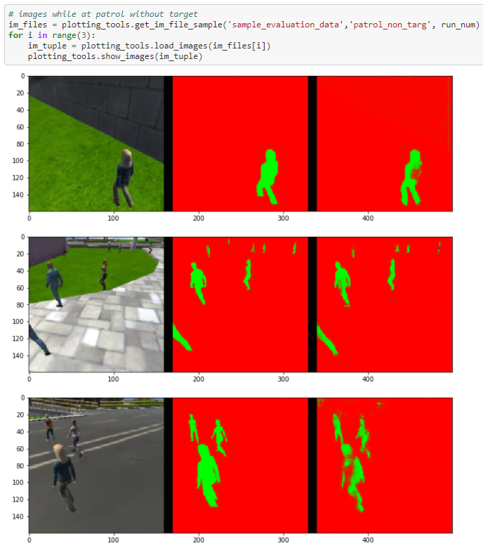

## Udacity Project 4: Follow me


### Introduction  
The purpose of the Udacity follow me project was to get the students familiar with buidling and training fully convolutional neural networks for the purpose performing semantic segmenation.  The Semantic segmentation was to locate the hero individual in an environment full of other people.  Once the hero was found the quad copter was supposed to follow the hero target around the environment.  


### Environment Setup
After using git and cloning the RoboND-Segmentation-Lab the contents were explored and the Segementation-Lab.ipynb file was opened in Jupyter Notebook to begin building the FCN.

### AWS Configuration
The most difficult portion of this project was transferring files from my local machine to the AWS instance, I had created to speed up training of the Neural Network.  I choose the route of setting up a role within AWS.  This role provided full access to my S3 object that contained all of the data for the project.  Once the role was created I had create a new instance that included access to the S3 object.  AWS client tools then had to be installed and the files were copied to the Ubuntu/home directory for easy access.  

### Encoder
The encoder is essentially a fully convolutional network that takes an input image and applies a series of convolutions to reduce the resolution to a lower and more compact scale.  When the resolution and scale are at the desired values a set of 1x1 convolutions can be applied to do pixel by pixel evaluations looking for any object that a user may be trying to recognize.  The object of interest will have a unique value when processed by the 1x1 convolutions 

### Decoder
The Decoder is essentially the opposite of the Encoder.  The Decoder takes the output from the 1x1 convolutions and upscales them to their original size.  This is a strength of FCN's, the fact that the input image size does not matter for the training of the network.  Billinear upsampling was used for this project.  This means that for the 2 x 2 filter the upsampling to a 4x4 would be linearly interpolated between the values.  layer concatenation was implemented in the decoder block to improve accuracy.  The layer concatenation works by taking an unsampled layer with a larger amount of spatial information and adding to it pixel by pixel the filtered information. 


### FCN layer construction
3 functions were provided by Udacity to ease the burden of creating all of the layers for the FCN.  The the seperable_conv2d_batchnorm function was used in both th Encoder and Decoder blocks.  The strides were were set to two with same padding.  The functions both used relu activations which are easy to implement and allow a controllable non-linearity to be applied to the system, this allows the model to approximate more complex problems. A seperable 2d convolution with batch normalization was used via the kera module.  Seperable convolutions differ from normal convolutions in the way that pixels are mapped.  Seperable convolutions perofrm both a depthwise convolution and point by point convolution.  The settings for these convolutions were are shown below in the code section with the inputs to the functions being (inputs/input_layer, depth of filter, strides).  The decoder layers have the same input.  

```python
def fcn_model(inputs, num_classes):
    
    # TODO Add Encoder Blocks. 
    # Remember that with each encoder layer, the depth of your model (the number of filters) increases.
    layer1 = encoder_block(inputs, 64, 2)
    layer2 = encoder_block(layer1, 128, 2)    
        
    # TODO Add 1x1 Convolution layer using conv2d_batchnorm().
    layer3 = conv2d_batchnorm(layer2, 256, kernel_size=1, strides=1)
   
    # TODO: Add the same number of Decoder Blocks as the number of Encoder Blocks
    layer4 = decoder_block(layer3, layer1, 64)
    layer5 = decoder_block(layer4, inputs, 128)
    # The function returns the output layer of your model. "x" is the final layer obtained from the last decoder_block()
    return layers.Conv2D(num_classes, 3, activation='softmax', padding='same')(layer5)
```

```python
def bilinear_upsample(input_layer):
    output_layer = BilinearUpSampling2D((2,2))(input_layer)
    return output_layer
```
### FCN diagram

The heirarch of the FCN constructed started with a a 256x256x3 rgb image.  This image was passed through a convolutional filter of 3x3 with a stride of two that reduced the height and width to: layer1 = 128x128, layer2=64x64 the coresponding decoder layers are the same height and width.  The 1x1 convolutions had a depth of 256.  It was thought that having a higher number for the 1x1 convolutions would result in the model being able to differentiate more precisely.

### FCN Model and Parameters
An Encoder and Decoder function was created to aid in the setup of the individaul layers.  Using these functions individual layers were created.  The order of the layers starts with the first layer after the input image and extends to layer 5.  Layer 5 is positioned just before the ouput of the FCN.    
```python
def encoder_block(input_layer, filters, strides):
    
    output_layer = separable_conv2d_batchnorm(input_layer, filters, strides=2)
    
    return output_layer
    
def decoder_block(small_ip_layer, large_ip_layer, filters):
    
    # TODO Upsample the small input layer using the bilinear_upsample() function.
    up_sample = bilinear_upsample(small_ip_layer)
    
    # TODO Concatenate the upsampled and large input layers using layers.concatenate
    concat_layer = layers.concatenate([up_sample, large_ip_layer])
    
    # TODO Add some number of separable convolution layers
    
    t_layer = separable_conv2d_batchnorm(concat_layer, filters, strides=1)
    output_layer = separable_conv2d_batchnorm(t_layer, filters, strides=1)
    return output_layer
```

### Hyper parameters and the Meaning
```python
first run on AWS
learning_rate = .001
batch_size = 50
num_epochs = 50
steps_per_epoch = 200
validation_steps = 50
workers = 20
approximate time = 227s * 50epochs= 189 min
```

```python
second runon on AWS
learning_rate = .001
batch_size = 50
num_epochs = 50
steps_per_epoch = 50
validation_steps = 50
workers = 20
approximate time = 69s * 50 epochs = 57 min 
```
The configuration of hyper parameters between the two runs had a large difference in the time required to compute.  Th accuracy of the second run was higher even for a reduced training time.

Listed above are the Hyper parameters used for to train the FCN for Semantic Segmentaion.  The learning rate is a multiplier that is used to increase or decrease the values of the weights used for learning.  This learning rate is multiplied by the backpropagation error formed from the chain rule.  I choose a low value to increase my overal accuracy.  I could have choosen a larger value but desire accuracy over speed.  If a larger value was choosen the model would reach steady state accuracy faster but then over and under shoot the target after reaching its critcal point.

The batch size corresponds the the number of images or samples that are input into the network per pass.  I Choose a value of 50 to ensure the batch size was small compared to the overall data set.  

Num epochs was set to 50.  This is the number of loops that network will go though.  the number or steps per epoch must be completed before the next epoch can start.  This means 50 pictures per step were input for 200 steps and 50 epochs.  50*200*50 = 500,000 samples.

Steps per epoch represen the number of times the batch size is input into the newtork per epoch.  Changing this value has a signifigant increase on time required to train but only a margnial increase on the accuracy.

Workers represent the number of individual processes the platform can operate simultaneously.  This is analgous to thinking about men performing some time of construction/renovation.  The more workers a project has the faster it can be accomplished but the tougher it can be to organize.  If there is slight deviation to the orginaization the step can be performed out of order and cause signifigant set backs to the project.  Since the cpu is responsible for the coordination it can be taxing on the system if too many workers are called.  I choose a number of 20 which represents approximately 5 workers per cpu.  Given the high performance of the AWS machine I didnt think it was too high.

### Model training and accuracy
### Following Target


### Patrolling without Target


### Patrolling with Targe


### 1st run loss vs epochs segmentation lab


### Final run loss vs epochs segmentation lab


## Conclusion
Utilizing the AWS system I was able to train my model on the images provided in the repository.  I was able to get my accuracy up to 50% in a short amount of time by tweeking the parameters.  I tried several times to implement my trained model in the quad copter environment to test the follower function.  I tried implementig on two different machines with the RoboND environemnt installed the error below was received on both machines.  I ensured that the directions were correctly followed and that the correct dependencies had been installed to support the simulator.  I used AWS s3 buckets to transfer files to an from my AWS instnace and local directories.  I tested this feature on a known file type to ensure that there wasnt some type of conversion error and it worked perfectly.  I did not see any common problems for the error I received and dont know what could be causing it.  Moving forwared I would like to get the simulator to work correctly and capture more data with the hero in the environemt to implement a higher accruracy for my model.  Another topic of interest would be to reduce the filter size of my model until a change of performance was noted.

We used pictures of people to train this FCN to look for a specific person but images of almost any object could be detected given the right training set.  These images could be cars, animals, types of plants, or even medical imagery looking for anomalies.
### Final accuracy


### Final loss vs epoch


### Sources
1)  https://www.quora.com/What-is-the-difference-between-an-usual-convolution-layer-and-a-separable-convolution-layer-used-in-depthwise-separable-DL-models

2  https://en.wikipedia.org/wiki/Convolutional_neural_network
